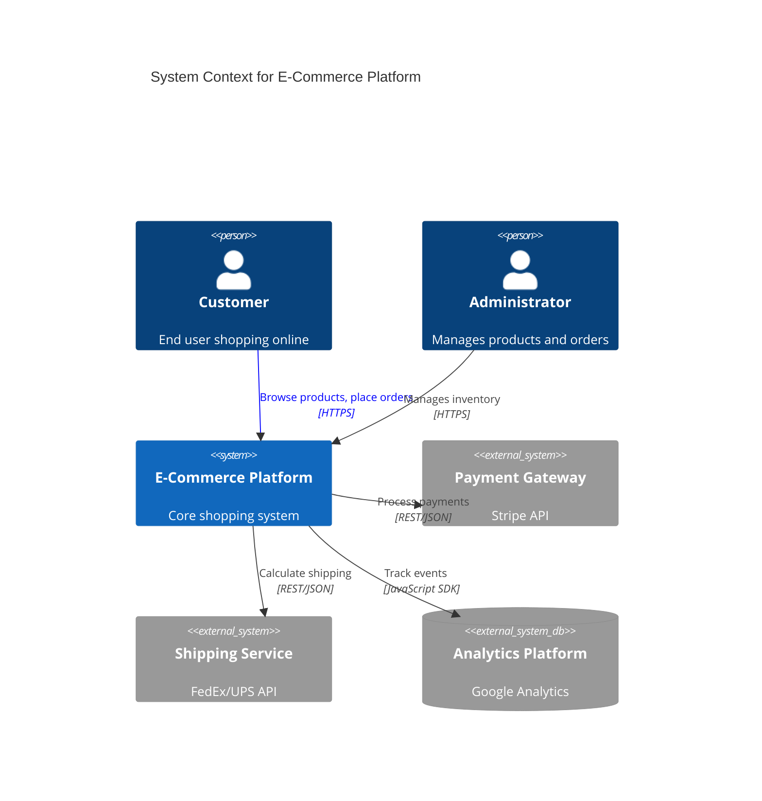
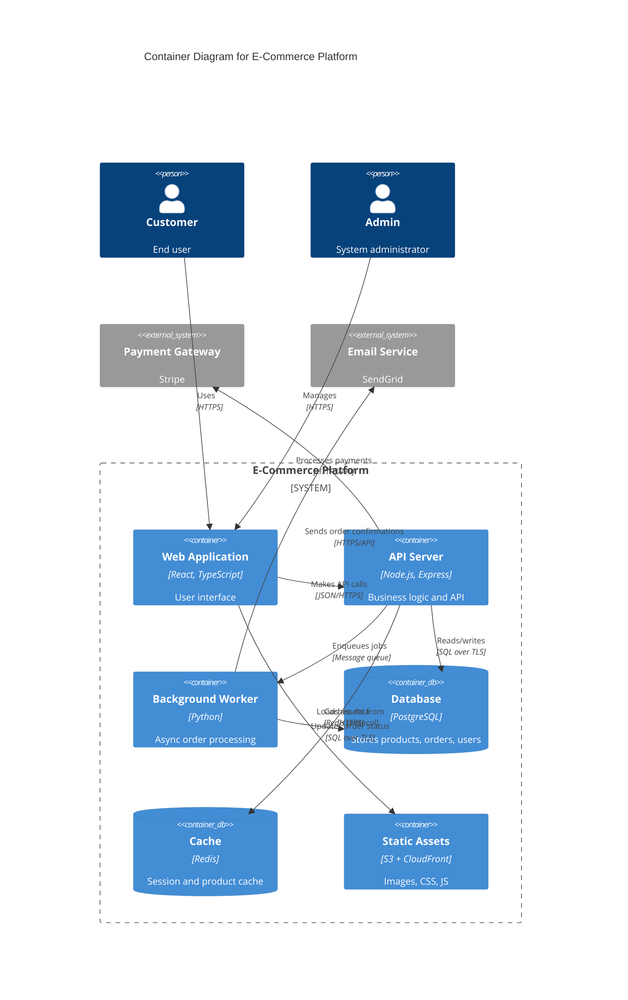
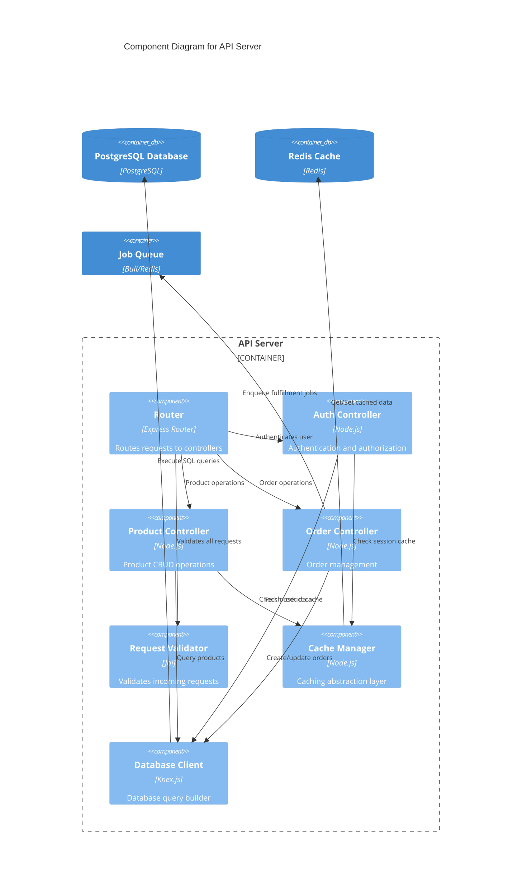
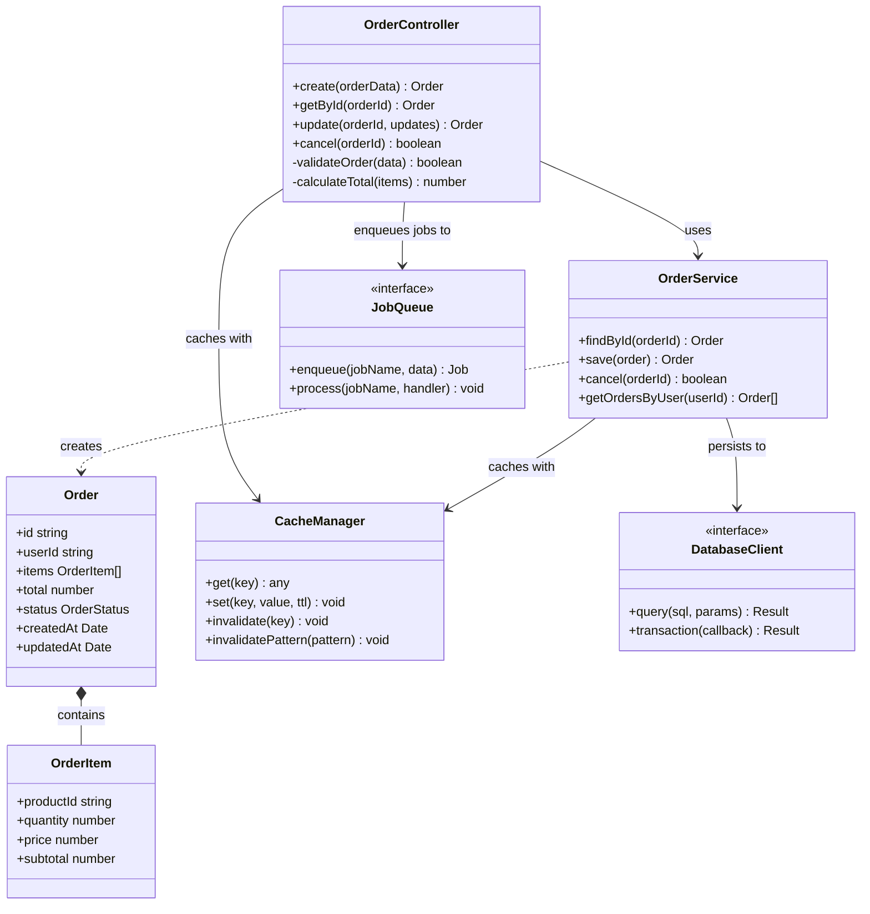
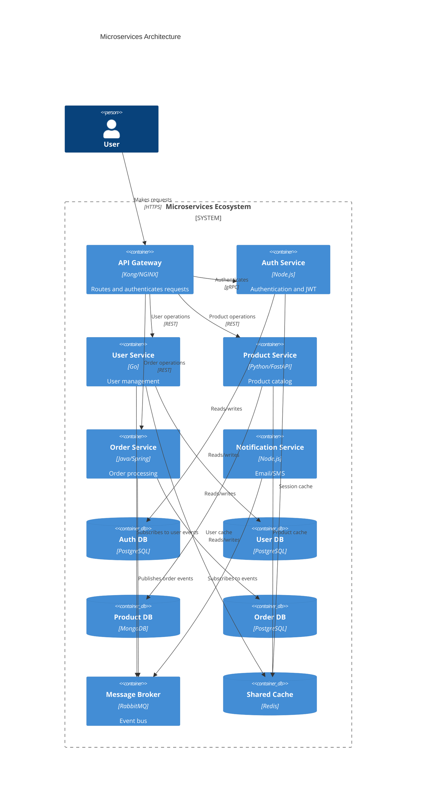
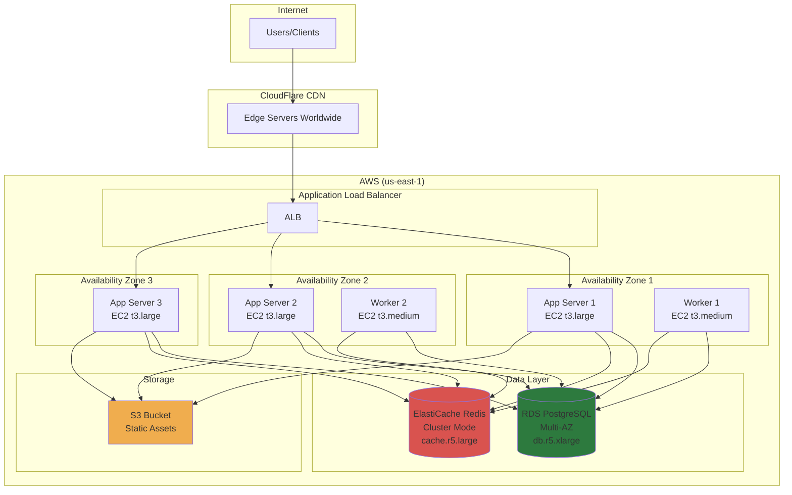

# Mermaid C4 Architecture Diagrams

Complete examples of C4 model architecture diagrams using Mermaid syntax.

## Level 0: System Context

Shows the system and its relationships with users and external systems.

**When to use:**
- Initial architecture documentation
- Explaining system boundaries
- Stakeholder communication
- Medium article: "How [System] fits in the ecosystem"

## Level 1: Container Diagram

Shows major technology containers (applications, databases, file systems).

**When to use:**
- Showing technical architecture
- Deployment planning
- Technology stack explanation
- Medium article: "How we built [System]"

## Level 2: Component Diagram

Shows components within a container and their relationships.

**When to use:**
- Detailed technical documentation
- Code review preparation
- Onboarding new developers
- Medium article: "Inside the [Component] architecture"

## Level 3: Code Diagram (Class Diagram)

Shows classes, interfaces, and their relationships.

**When to use:**
- Detailed implementation documentation
- Design pattern explanation
- Code refactoring planning

## Microservices Architecture Example

## Deployment Topology

**When to use:**
- Infrastructure documentation
- Deployment planning
- Scaling strategy explanation
- Medium article: "How we scale [System]"
