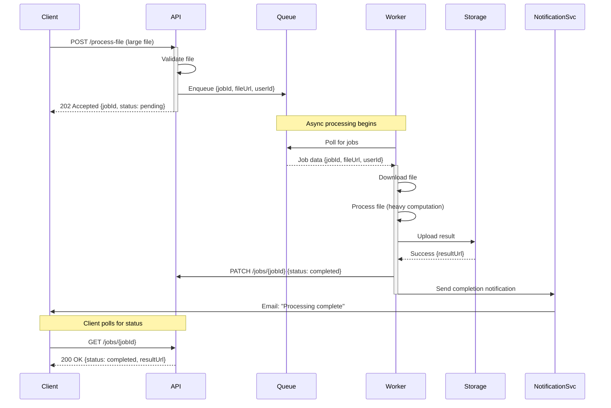
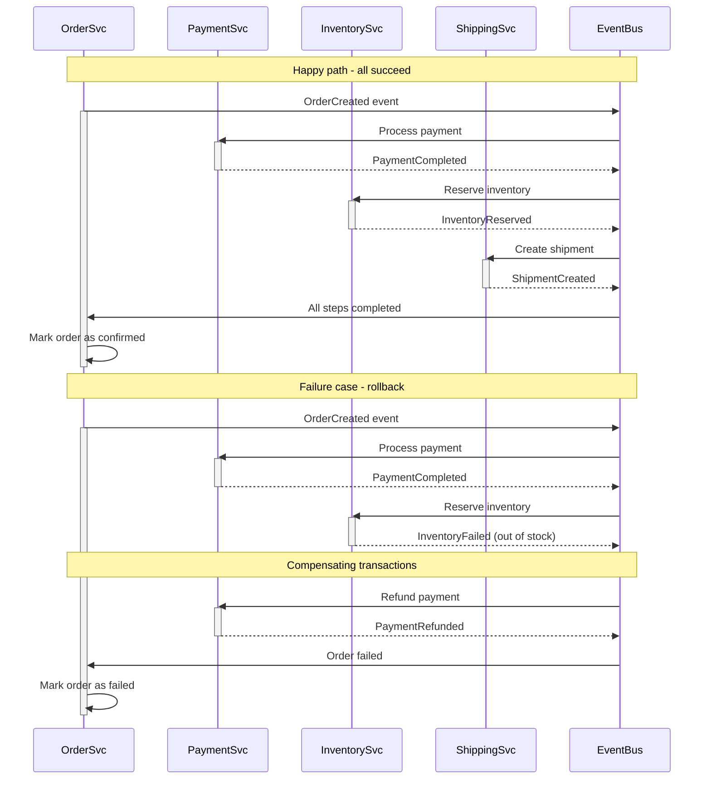
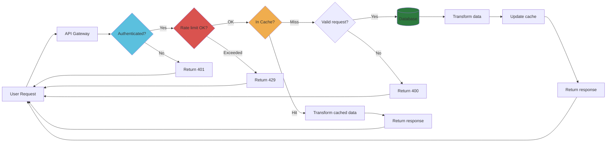
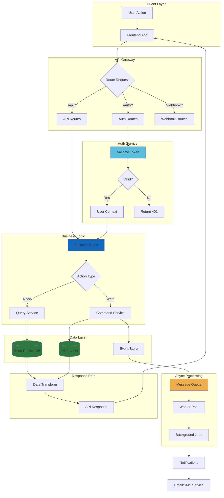
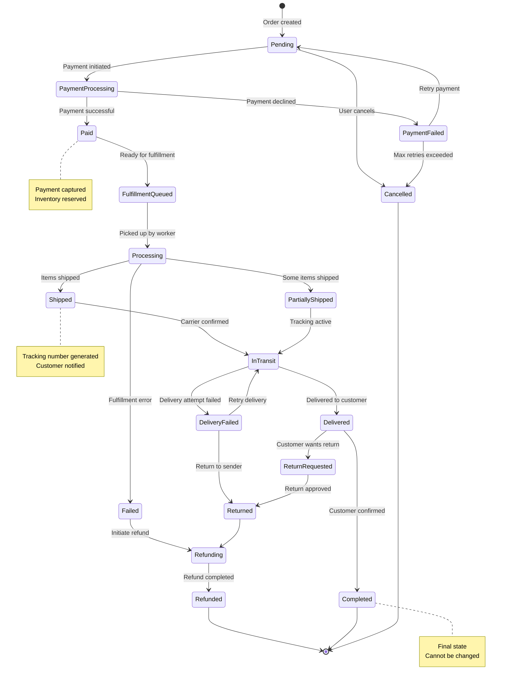
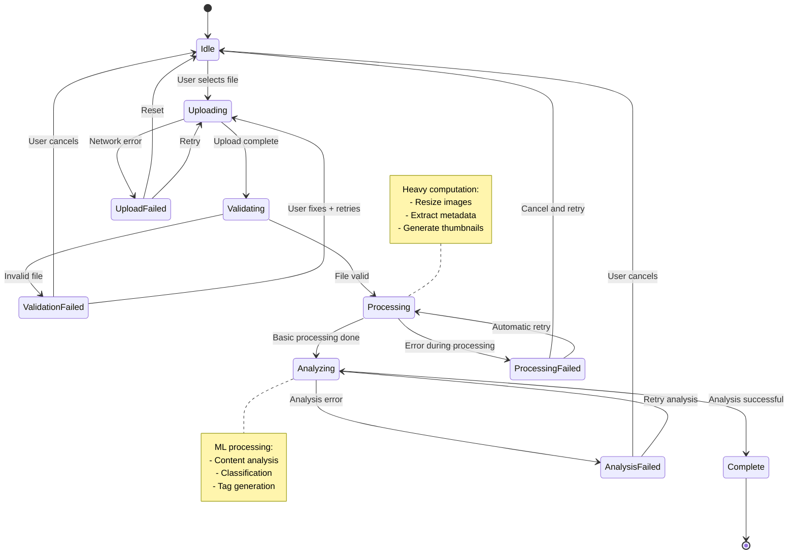
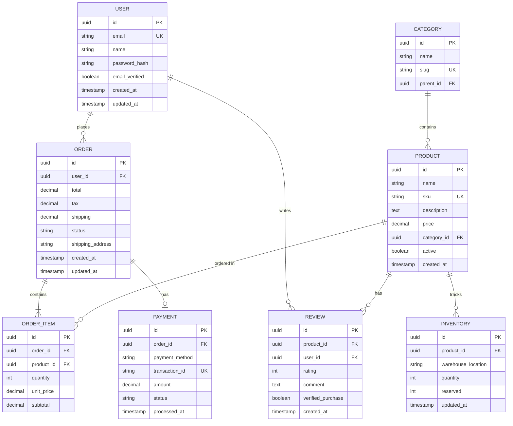
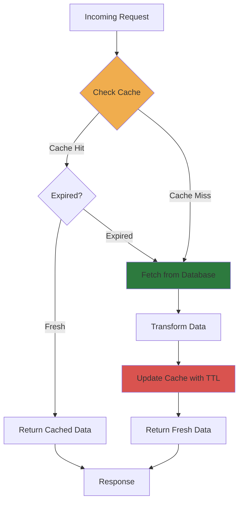
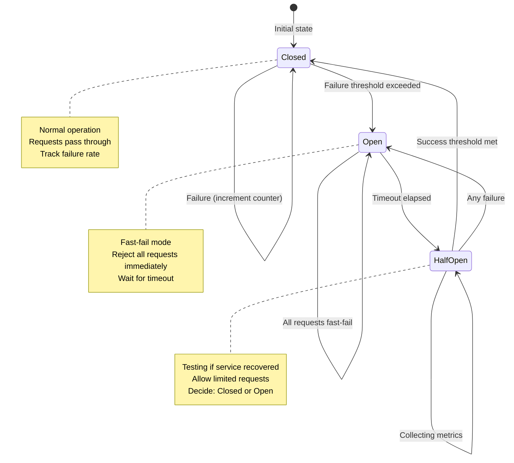

# Mermaid Sequence and Flow Diagrams

Complete examples of sequence diagrams, flowcharts, and state machines using Mermaid.

## Sequence Diagrams

### API Authentication Flow

```mermaid
sequenceDiagram
    participant User
    participant Frontend
    participant API
    participant AuthService
    participant Database

    User->>Frontend: Enter credentials
    Frontend->>API: POST /auth/login {email, password}
    activate API

    API->>AuthService: validateCredentials()
    activate AuthService

    AuthService->>Database: SELECT user WHERE email=?
    Database-->>AuthService: User data

    AuthService->>AuthService: verifyPassword(hash, input)

    alt Password valid
        AuthService-->>API: Valid + user data
        deactivate AuthService

        API->>API: generateJWT(user)
        API-->>Frontend: 200 OK + {token, user}
        deactivate API

        Frontend->>Frontend: Store token in localStorage
        Frontend-->>User: Redirect to dashboard
    else Password invalid
        AuthService-->>API: Invalid credentials
        deactivate AuthService
        API-->>Frontend: 401 Unauthorized
        deactivate API
        Frontend-->>User: Show error message
    end
```

### Async Job Processing Workflow



### Distributed Transaction (Saga Pattern)



## Flowcharts and Data Flows

### Request Processing with Caching



### Complex Processing Pipeline with Swimlanes



## State Machines

### Order Lifecycle State Machine



### File Upload State Machine



## Entity Relationship Diagram



## Common Patterns

### Caching Strategy Flow



### Circuit Breaker Pattern



These diagrams provide comprehensive examples for documenting systems, APIs, and workflows!
