# Mermaid Diagram Examples

This document demonstrates the Mermaid diagram generation capabilities available through the `diagram-specialist` agent and `/orchestr8:generate-diagrams` command.

## Quick Start

Generate diagrams for your project:

```bash
# Generate all diagram types
/orchestr8:generate-diagrams .

# Generate only architecture diagrams
/orchestr8:generate-diagrams . --type=architecture

# Generate for specific component
/orchestr8:generate-diagrams src/services/api
```

## Example Diagrams

### 1. System Context (C4 L0)

Shows the big picture - your system and its external dependencies.

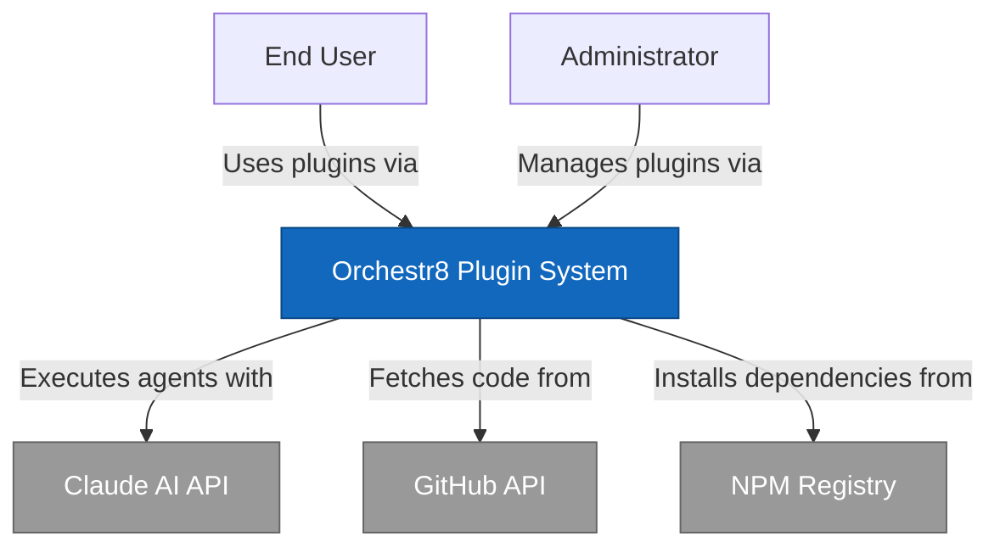

**Use Case**: High-level overview for stakeholders, architecture reviews, documentation.

---

### 2. Container Diagram (C4 L1)

Shows major applications, services, and data stores.

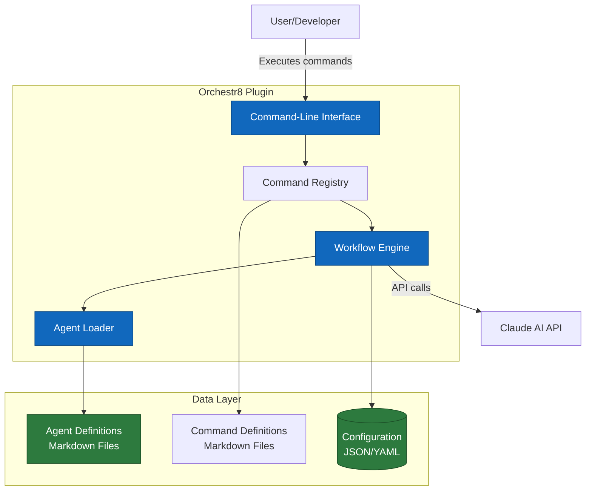

**Use Case**: Understanding system architecture, onboarding new developers, technical documentation.

---

### 3. Data Flow Diagram

Shows how data moves through the system.

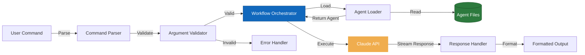

**Use Case**: Understanding data transformations, debugging data issues, optimization opportunities.

---

### 4. Sequence Diagram

Shows API interactions and timing.

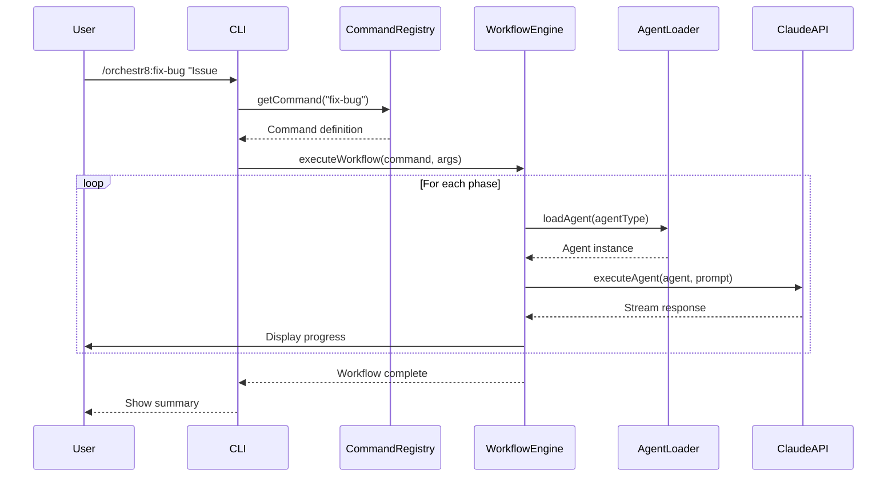

**Use Case**: API debugging, performance optimization, understanding async workflows.

---

### 5. User Journey Flow

Shows user decision paths and experiences.

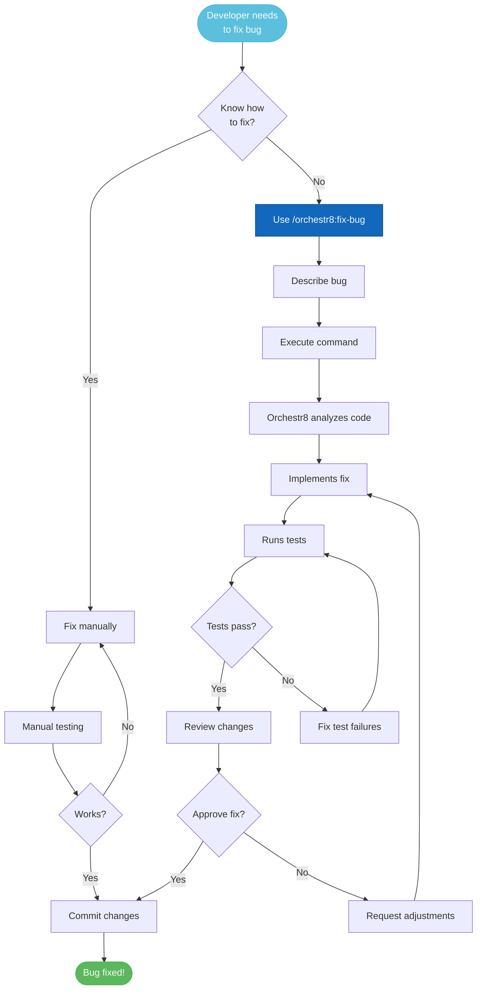

**Use Case**: UX improvements, identifying pain points, user onboarding.

---

### 6. Entity Relationship Diagram

Shows database schema relationships.

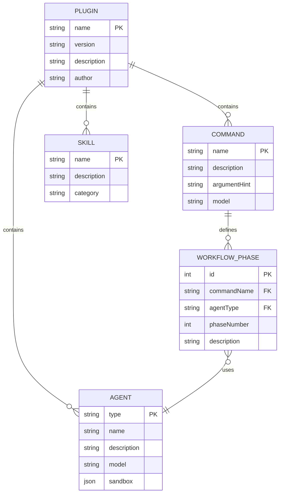

**Use Case**: Database design, understanding relationships, migration planning.

---

### 7. State Machine Diagram

Shows workflow states and transitions.

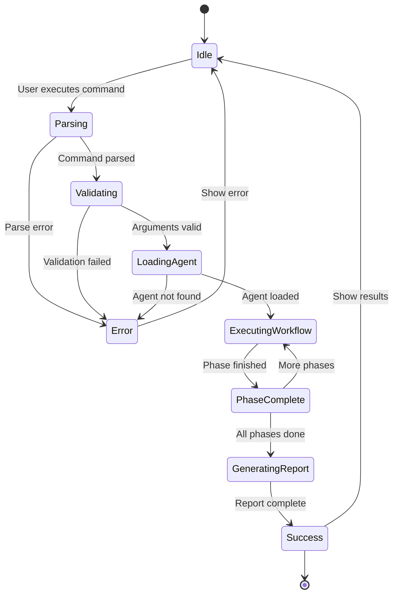

**Use Case**: Understanding workflow states, debugging state transitions, documenting processes.

---

### 8. Deployment Diagram

Shows infrastructure and deployment topology.

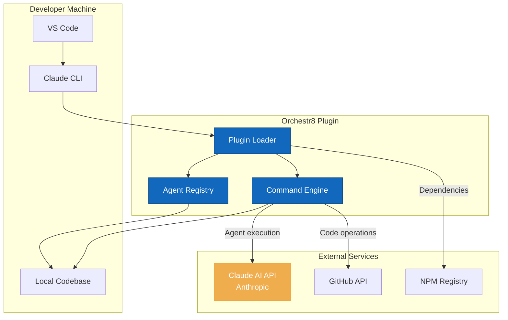

**Use Case**: Infrastructure documentation, deployment planning, architecture reviews.

---

## Diagram Types Summary

| Type | Purpose | When to Use |
|------|---------|-------------|
| **System Context (L0)** | Big picture view | Stakeholder presentations, high-level docs |
| **Container (L1)** | Apps, services, databases | Architecture reviews, onboarding |
| **Component (L2)** | Internal structure | Detailed technical docs, refactoring |
| **Code (L3)** | Classes and relationships | Deep technical docs, complex modules |
| **Data Flow** | Data movement | Debugging, optimization, understanding flows |
| **Sequence** | Time-based interactions | API debugging, async workflows |
| **User Journey** | User paths and decisions | UX improvements, feature planning |
| **ERD** | Database relationships | Schema design, migrations |
| **State Machine** | States and transitions | Workflow documentation, debugging |
| **Deployment** | Infrastructure topology | DevOps, deployment planning |

---

## Best Practices

### 1. Keep Diagrams Focused
Don't try to show everything in one diagram. Create multiple diagrams for different perspectives.

### 2. Update Regularly
Diagrams become stale. Regenerate after major changes:
```bash
/orchestr8:generate-diagrams . --type=all
```

### 3. Use Consistent Styling
Follow the color scheme:
- **Blue**: Internal systems
- **Gray**: External systems
- **Green**: Databases
- **Red**: Caching
- **Orange**: Queues/Events
- **Light Blue**: User interactions

### 4. Add Context
Every diagram should have:
- Title describing what it shows
- Brief description (1-2 sentences)
- Legend if using custom symbols

### 5. Test Rendering
Verify diagrams render correctly in:
- GitHub (automatic)
- VS Code (Mermaid extension)
- [Mermaid Live Editor](https://mermaid.live)

---

## Integration with Architecture Review

The `/orchestr8:review-architecture` command can now optionally generate diagrams:

```bash
# Architecture review with diagrams
/orchestr8:review-architecture . --with-diagrams

# Just diagrams, no review
/orchestr8:generate-diagrams .
```

---

## Viewing Diagrams

### GitHub
Diagrams render automatically in GitHub Markdown files.

### VS Code
Install the "Markdown Preview Mermaid Support" extension.

### Mermaid Live Editor
1. Copy diagram code
2. Go to https://mermaid.live
3. Paste and edit

---

## Advanced Features

### Custom Themes
Modify node styles for custom branding:
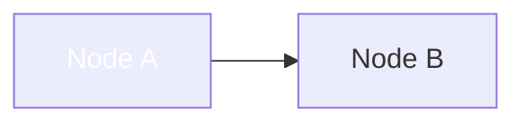

### Subgraphs for Grouping
Organize related components:
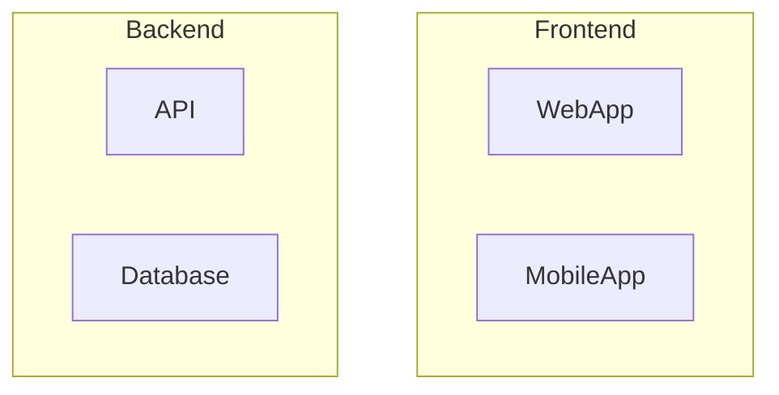

### Links in Diagrams
Add clickable links (GitHub only):
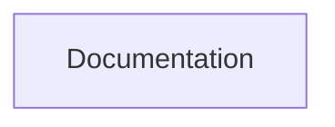

---

## Next Steps

1. **Generate your first diagrams**: `/orchestr8:generate-diagrams .`
2. **Review generated diagrams**: Check `.orchestr8/docs/diagrams/`
3. **Include in docs**: Link diagrams from your README
4. **Keep updated**: Regenerate after major changes

Happy diagramming! 🎨
